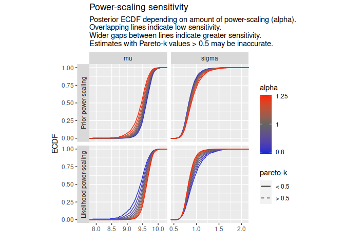
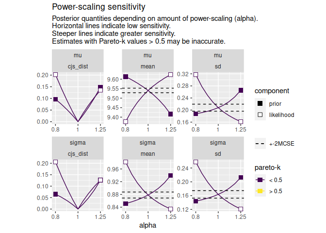

<!-- README.md is generated from README.Rmd. Please edit that file -->


# priorsense

<!-- badges: start -->
[](https://www.tidyverse.org/lifecycle/#experimental) [](https://CRAN.R-project.org/package=priorsense) [](https://github.com/n-kall/priorsense/actions) [](https://app.codecov.io/gh/n-kall/priorsense?branch=master) <!-- badges: end -->

## Overview

priorsense provides tools for prior diagnostics and sensitivity analysis.

It currently includes functions for performing power-scaling sensitivity analysis on Stan models. This is a way to check how sensitive a posterior is to perturbations of the prior and likelihood and diagnose the cause of sensitivity. For efficient computation, power-scaling sensitivity analysis relies on Pareto smoothed importance sampling (Vehtari et al., 2021) and importance weighted moment matching (Paananen et al., 2021).

Power-scaling sensitivity analysis and priorsense are described in Kallioinen et al. (2022).

## Installation

Download the development version from [GitHub](https://github.com/) with:

``` r
# install.packages("remotes")
# remotes::install_github("n-kall/iwmm")
remotes::install_github("n-kall/priorsense", ref = "separate_scaling")
```

## Usage

priorsense currently works with models created with rstan, cmdstanr or brms. However, moment matching currently does not work with cmdstan models.

### Example

Consider a simple univariate model with unknown mu and sigma fit to some data y (available via`example_powerscale_model("univariate_normal")`):

``` stan
data {
  int<lower=1> N;
  real y[N];
}
parameters {
  real mu;
  real<lower=0> sigma;
}
model {
  // priors
  target += normal_lpdf(mu | 0, 1);
  target += normal_lpdf(sigma | 0, 2.5);
  // likelihood
  target += normal_lpdf(y | mu, sigma);
}
generated quantities {
  vector[N] log_lik;
  // likelihood
  real lprior;
  for (n in 1:N) log_lik[n] =  normal_lpdf(y[n] | mu, sigma);
  // joint prior specification
  lprior = normal_lpdf(mu | 0, 1) +
    normal_lpdf(sigma | 0, 2.5);
}
```

We first fit the model using Stan:

``` r
library(priorsense)

normal_model <- example_powerscale_model("univariate_normal")

fit <- rstan::stan(
  model_code = normal_model$model_code,
  data = normal_model$data,
  refresh = FALSE,
  seed = 1234
)
```

Once fit, sensitivity can be checked as follows:

``` r
powerscale_sensitivity(fit)
#> Loading required namespace: testthat
#> Sensitivity based on cjs_dist:
#> # A tibble: 2 × 4
#>   variable prior likelihood diagnosis          
#>   <chr>    <dbl>      <dbl> <chr>              
#> 1 mu       0.368      0.519 prior-data conflict
#> 2 sigma    0.266      0.512 prior-data conflict
```

To visually inspect changes to the posterior, first create a power-scaling sequence.

``` r
pss <- powerscale_sequence(fit)
#> Warning: Some Pareto k diagnostic values are slightly high. See help('pareto-k-diagnostic') for details.
```

Then use a plotting function. Estimates that may be inaccurate (Pareto-k values &gt; 0.5) are indicated.

``` r
powerscale_plot_ecdf(pss, variables = c("mu", "sigma"))
#> Warning: The following aesthetics were dropped during statistical transformation: weight
#> ℹ This can happen when ggplot fails to infer the correct grouping structure in the data.
#> ℹ Did you forget to specify a `group` aesthetic or to convert a numerical variable into a factor?
#> The following aesthetics were dropped during statistical transformation: weight
#> ℹ This can happen when ggplot fails to infer the correct grouping structure in the data.
#> ℹ Did you forget to specify a `group` aesthetic or to convert a numerical variable into a factor?
#> The following aesthetics were dropped during statistical transformation: weight
#> ℹ This can happen when ggplot fails to infer the correct grouping structure in the data.
#> ℹ Did you forget to specify a `group` aesthetic or to convert a numerical variable into a factor?
#> The following aesthetics were dropped during statistical transformation: weight
#> ℹ This can happen when ggplot fails to infer the correct grouping structure in the data.
#> ℹ Did you forget to specify a `group` aesthetic or to convert a numerical variable into a factor?
```



``` r
powerscale_plot_quantities(
  pss,
  quantities = c("mean", "sd"),
  div_measure = "cjs_dist",
  variables = c("mu", "sigma")
)
```



## References

Noa Kallioinen, Topi Paananen, Paul-Christian Bürkner, Aki Vehtari (2022). Detecting and diagnosing prior and likelihood sensitivity with power-scaling. preprint [arXiv:2107.14054](https://arxiv.org/abs/2107.14054)

Topi Paananen, Juho Piironen, Paul-Christian Bürkner, Aki Vehtari (2021). Implicitly adaptive importance sampling. Statistics and Computing 31, 16. <https://doi.org/10.1007/s11222-020-09982-2>

Aki Vehtari, Daniel Simpson, Andrew Gelman, Yuling Yao, Jonah Gabry (2021). Pareto smoothed importance sampling. preprint [arXiv:1507.02646](https://arxiv.org/abs/1507.02646)
