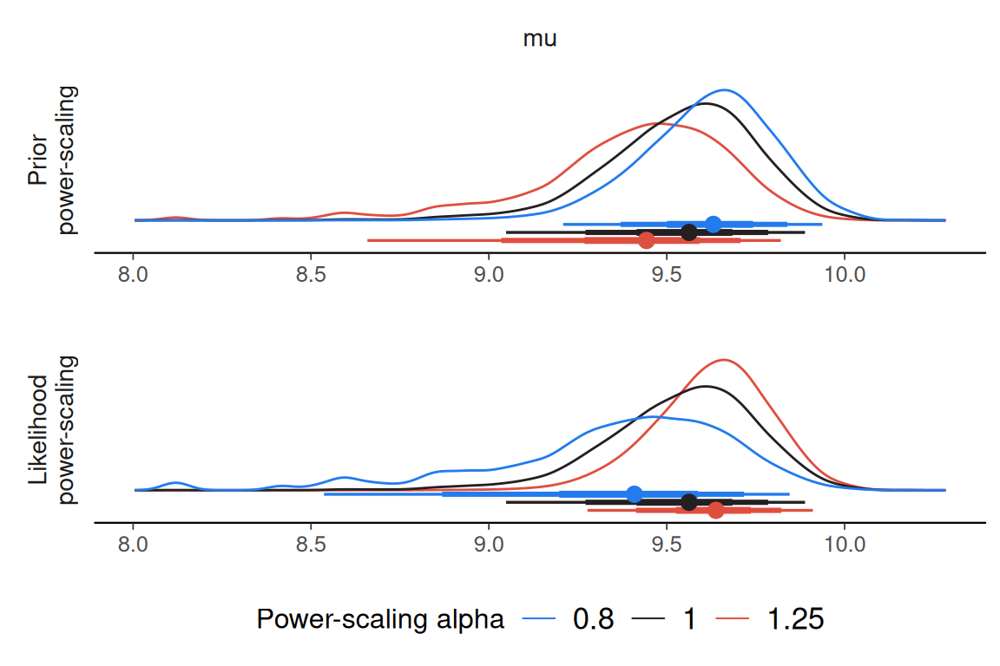
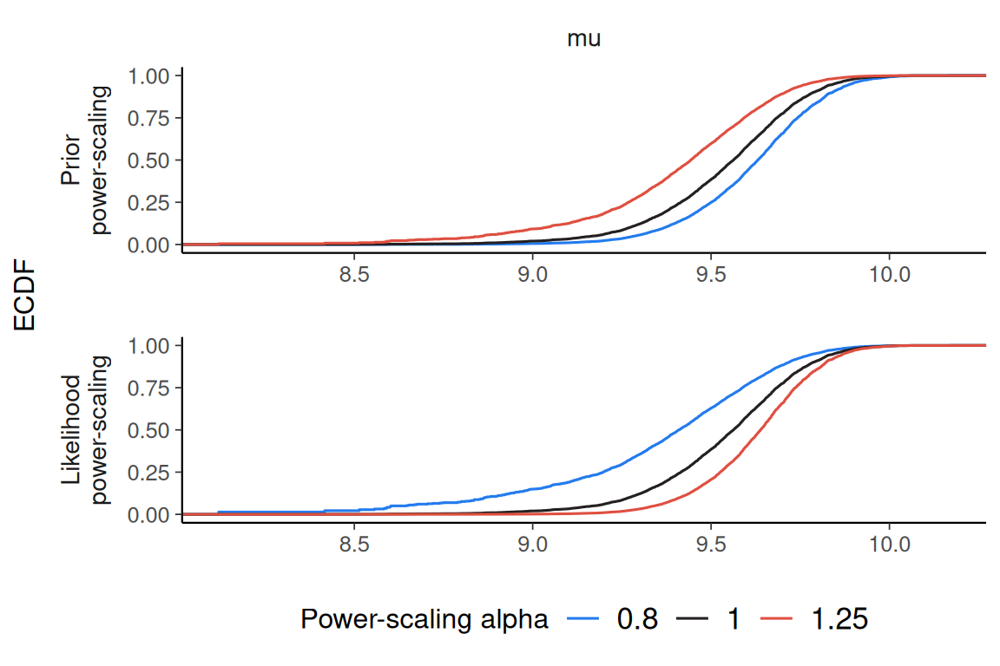
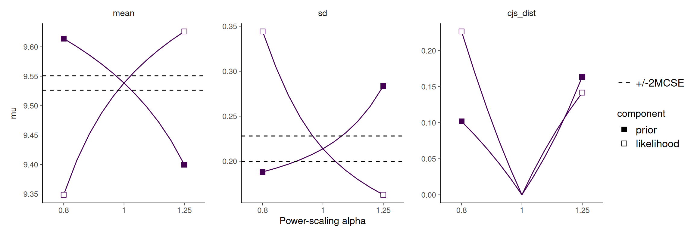

# Getting started with priorsense

## Introduction

priorsense is a package for prior and likelihood sensitivity diagnostics
in Bayesian models. It currently implements power-scaling sensitivity
analysis but may be extended in the future to include other diagnostics.

## Power-scaling sensitivity analysis

Power-scaling sensitivity analysis tries to determine how small changes
to the prior or likelihood affect the posterior. This is done by
power-scaling the prior or likelihood by raising it to some
$`\alpha > 0`$.

- For prior power-scaling: $`p(\theta \mid y) \propto p(\theta)^\alpha
  p(y \mid \theta)`$
- For likelihood power-scaling: $`p(\theta \mid y) \propto
  p(\theta) p(y \mid \theta)^\alpha`$

In priorsense, this is done in a computationally efficient manner using
Pareto-smoothed importance sampling (and optionally importance weighted
moment matching) to estimate properties of these perturbed posteriors.
Sensitivity can then be quantified by considering how much the perturbed
posteriors differ from the base posterior.

priorsense works with models created with `brms`, `rstan`, `cmdstanr`,
`brms`, `R2jags`, `jagsUI`, `nimble`, or with `draws` objects from the
`posterior` package.

## Requirements

priorsense needs two things that are usually not stored in a model fit
by default: (unnormalized) log-prior and log-likelihood evaluations of
the posterior draws. In many modelling languages, the model code can be
adjusted so that these are saved as the model is fit. Otherwise, these
can be created from the posterior draws manually. The default names of
these variables are `lprior` and `log_lik`.

For instructions how to adapt model code, see the vignettes for each
supported language:

- `brms`:
  [`vignette("priorsense_with_brms")`](https://n-kall.github.io/priorsense/articles/priorsense_with_brms.md)
- Stan (`cmdstanr` or `rstan`):
  [`vignette("priorsense_with_stan")`](https://n-kall.github.io/priorsense/articles/priorsense_with_stan.md)
- JAGS (`jagsUI` or `R2jags`):
  [`vignette("priorsense_with_jags")`](https://n-kall.github.io/priorsense/articles/priorsense_with_jags.md)
- NIMBLE:
  [`vignette("priorsense_with_nimble")`](https://n-kall.github.io/priorsense/articles/priorsense_with_nimble.md)

## Simple example

Consider a simple univariate normal model with unknown mu and sigma fit
to some data y (available
via`example_powerscale_model("univariate_normal")`):

``` math
y \sim \text{normal}(\mu, \sigma)
```

with priors:

``` math
\mu \sim \text{normal}(0, 1)
```

``` math
\sigma \sim \text{normal}^+(0, 2.5)
```

``` r

normal_model <- example_powerscale_model("univariate_normal")

fit <- normal_model$draws
```

Once you have posterior draws, sensitivity can be checked as follows.

We first check the sensitivity of the prior and likelihood to
power-scaling. The sensitivity values shown below are an indication of
how much the posterior changes with respect to power-scaling. Larger
values indicate more sensitivity. By default these values are derived
from the gradient of the Cumulative Jensen-Shannon distance between the
base posterior and posteriors resulting from power-scaling. Without
specifying a `prior_selection`, the joint prior will be power-scaled.

``` r

powerscale_sensitivity(fit)
```

    Sensitivity based on cjs_dist
    Prior selection: all priors
    Likelihood selection: all data

     variable prior likelihood                           diagnosis
           mu 0.390      0.558 potential prior-likelihood conflict
        sigma 0.288      0.527 potential prior-likelihood conflict

To visually inspect changes to the posterior, use one of the diagnostic
plot functions. Estimates with high Pareto-k values may be inaccurate
and are indicated.

There are three plots currently available:

- Kernel density estimates:

``` r

powerscale_plot_dens(fit, variable = "mu")
```



- Empirical cumulative distribution functions:

``` r

powerscale_plot_ecdf(fit, variable = "mu")
```



- Quantities:

``` r

powerscale_plot_quantities(fit, variable = "mu")
```



As can be seen in the plots, power-scaling the prior and likelihood have
opposite direction effects on the posterior. This is further evidence of
prior-likelihood conflict.

Indeed, if we inspect the raw data, we see that the prior on $`\mu`$,
$`\text{normal}(0, 1)`$ does not match well with the mean of the data,
whereas the prior on $`\sigma`$, $`\text{normal}^+(0, 2.5)`$ is
reasonable:

``` r

mean(normal_model$data$y)
```

    [1] 9.844

``` r

sd(normal_model$data$y)
```

    [1] 0.7697835
