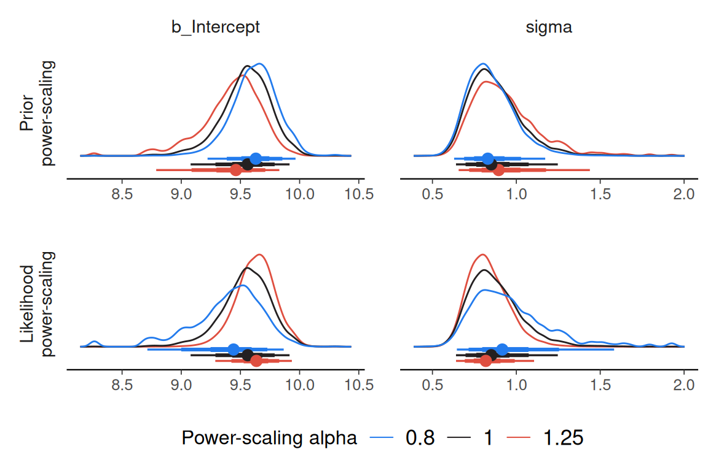

# Using priorsense with brms

``` r

library(posterior)
library(priorsense)
library(brms)
```

`brms` has built-in support for `priorsense`, such that it can be used
directly without any modifications to model code. However, priors can
also be tagged in order to selectively power-scale priors. Consider the
univariate normal model with unknown mu and sigma available
via`example_powerscale_model("univariate_normal")`. By also defining
separate `intercept` and `sigma` prior tags, it will be possible to
check the sensitivity for each prior separately.

``` r

normal_model <- example_powerscale_model(model = "univariate_normal")

priors <- c(
  prior(coef = "Intercept", normal(0, 1), tag = "intercept"),
  prior(class = "sigma", normal(0, 2.5), tag = "sigma")
)

fit <- brm(
  bf(y ~ 1, center = FALSE),
  data = data.frame(y = normal_model$data$y),
  prior = priors
)
```

Then the `priorsense` functions will work as usual.

``` r

powerscale_sensitivity(fit)
```

    Sensitivity based on cjs_dist
    Prior selection: all priors
    Likelihood selection: all data

        variable prior likelihood                           diagnosis
     b_Intercept 0.324      0.448 potential prior-likelihood conflict
           sigma 0.240      0.432 potential prior-likelihood conflict

``` r

powerscale_sensitivity(fit, prior_selection = "sigma")
```

    Sensitivity based on cjs_dist
    Prior selection: sigma
    Likelihood selection: all data

        variable prior likelihood diagnosis
     b_Intercept 0.003      0.448         -
           sigma 0.006      0.432         -

``` r

powerscale_sensitivity(fit, prior_selection = "intercept")
```

    Sensitivity based on cjs_dist
    Prior selection: intercept
    Likelihood selection: all data

        variable prior likelihood                           diagnosis
     b_Intercept 0.327      0.448 potential prior-likelihood conflict
           sigma 0.246      0.432 potential prior-likelihood conflict

``` r

powerscale_plot_dens(fit)
```


