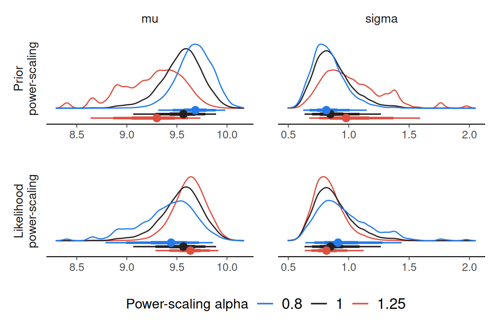

# Using priorsense with JAGS

``` r
library(R2jags)
library(posterior)
library(priorsense)
```

To use `priorsense` with a JAGS model, the log prior and log likelihood
evaluations should be added to the model code.

``` r
model_string <- "
model {
  for(n in 1:N) {
    y[n] ~ dnorm(mu, tau)
    log_lik[n] <- likelihood_alpha * logdensity.norm(y[n], mu, tau)
  }
  mu ~ dnorm(0, 1)
  sigma ~ dnorm(0, 1 / 2.5^2) T(0,)
  tau <- 1 / sigma^2
  lprior <- prior_alpha * logdensity.norm(mu, 0, 1) + logdensity.norm(sigma, 0, 1 / 2.5^2)
}
"
```

Using [`R2jags::jags()`](https://rdrr.io/pkg/R2jags/man/jags.html) to
fit the model.

``` r
model_con <- textConnection(model_string)
data <- example_powerscale_model()$data

set.seed(123)

# monitor parameters of interest along with log-likelihood and log-prior
variables <- c("mu", "sigma", "log_lik", "lprior")

jags_fit <- jags(
  data,
  model.file = model_con,
  parameters.to.save = variables,
  n.chains = 4,
  DIC = FALSE,
  quiet = TRUE,
  progress.bar = "none"
  )
```

Then the `priorsense` functions will work as usual.

``` r
powerscale_sensitivity(jags_fit)
```

    Sensitivity based on cjs_dist
    Prior selection: all priors
    Likelihood selection: all data

     variable prior likelihood                     diagnosis
           mu 0.753      0.524 potential prior-data conflict
        sigma 0.503      0.468 potential prior-data conflict

``` r
powerscale_plot_dens(jags_fit)
```


