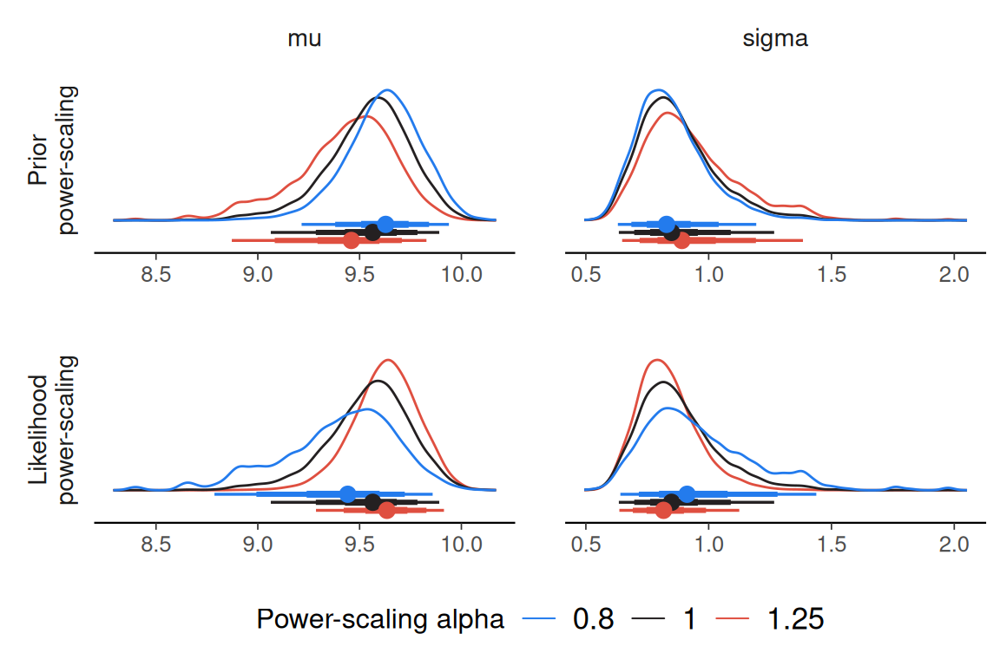

# Using priorsense with JAGS

``` r

library(R2jags)
library(posterior)
library(priorsense)

set.seed(123)
```

`priorsense` is compatible with models fit with either `jagsUI` or
`R2jags`.

Consider the univariate normal model with unknown mu and sigma available
via`example_powerscale_model("univariate_normal")`. In JAGS, `lprior`
and `log_lik` variables can be defined as below. By also defining
separate `lprior_mu` and `lprior_sigma` variables, it will be possible
to check the sensitivity for each prior separately.

``` r

model <- example_powerscale_model("univariate_normal", language = "jags")
```

    model {
      for(n in 1:N) {
        y[n] ~ dnorm(mu, tau)
        log_lik[n] <- logdensity.norm(y[n], mu, tau)
      }
      mu ~ dnorm(0, 1)
      sigma ~ dnorm(0, 1 / 2.5^2) T(0,)
      tau <- 1 / sigma^2

      lprior_mu <- logdensity.norm(mu, 0, 1)
      lprior_sigma <- logdensity.norm(sigma, 0, 1 / 2.5^2)
      lprior <- lprior_mu + lprior_sigma
    }

[`R2jags::jags()`](https://rdrr.io/pkg/R2jags/man/jags.html) or
`jagsUI::jags()` can be used to fit the model. Ensure that the required
variables are monitored.

``` r

model_con <- textConnection(model$model_code)
data <- model$data

# monitor parameters of interest along with log-likelihood and log-prior
variables <- c("mu", "sigma", "log_lik", "lprior", "lprior_mu", "lprior_sigma")

fit <- R2jags::jags(
  data = data,
  model.file = model_con,
  parameters.to.save = variables,
  n.chains = 4,
  DIC = FALSE,
  quiet = TRUE,
  progress.bar = "none"
)
```

Then the `priorsense` functions will work as usual.

``` r

powerscale_sensitivity(fit)
```

    Sensitivity based on cjs_dist
    Prior selection: all priors
    Likelihood selection: all data

     variable prior likelihood                           diagnosis
           mu 0.376      0.524 potential prior-likelihood conflict
        sigma 0.252      0.468 potential prior-likelihood conflict

``` r

powerscale_sensitivity(fit, prior_selection = "sigma")
```

    Sensitivity based on cjs_dist
    Prior selection: sigma
    Likelihood selection: all data

     variable prior likelihood diagnosis
           mu 0.003      0.524         -
        sigma 0.006      0.468         -

``` r

powerscale_sensitivity(fit, prior_selection = "mu")
```

    Sensitivity based on cjs_dist
    Prior selection: mu
    Likelihood selection: all data

     variable prior likelihood                           diagnosis
           mu 0.379      0.524 potential prior-likelihood conflict
        sigma 0.258      0.468 potential prior-likelihood conflict

``` r

powerscale_plot_dens(fit)
```


