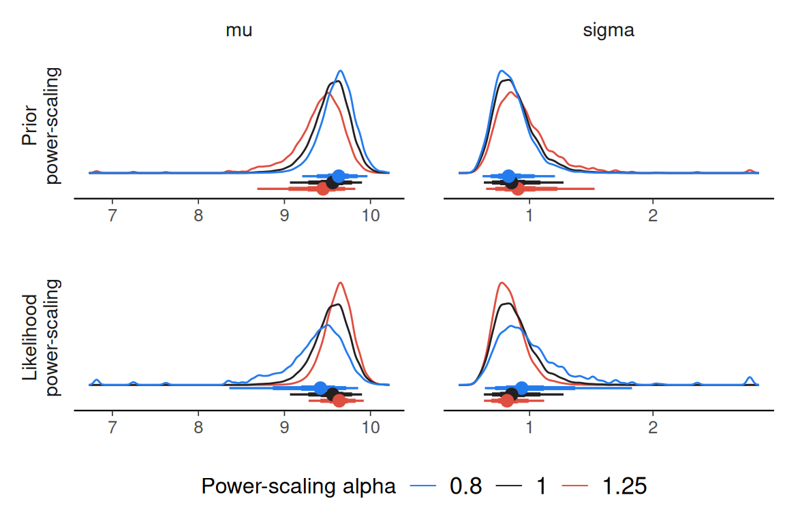

# Using priorsense with NIMBLE

``` r

library(nimble)
library(priorsense)
```

`priorsense` is compatible with models fit with `nimble`

Consider the univariate normal model with unknown mu and sigma available
via`example_powerscale_model("univariate_normal")`. In NIMBLE, `lprior`
and `log_lik` variables can be defined as below. By also defining
separate `lprior_mu` and `lprior_sigma` variables, it will be possible
to check the sensitivity for each prior separately.

``` r

model <- example_powerscale_model(language = "nimble")
```

    {
        for (n in 1:N) {
            y[n] ~ dnorm(mu, sd = sigma)
            log_lik[n] <- dnorm(y[n], mu, sd = sigma, log = TRUE)
        }
        mu ~ dnorm(0, sd = 1)
        sigma ~ dnorm(0, sd = 2.5)
        lprior_mu <- dnorm(mu, 0, sd = 1, log = TRUE)
        lprior_sigma <- dnorm(sigma, 0, sd = 2.5, log = TRUE)
        lprior <- lprior_mu + lprior_sigma
    }

Instantiate and compile the model as usual.

``` r

inits <- list(
  mu = 0,
  sigma = 1
)

model <- nimbleModel(
  model$model_code, # the nimble model code
  data = model$data,
  inits = inits,
  constants = list(N = model$data$N)
)

cmodel <- compileNimble(model)

mcmc <- buildMCMC(
  cmodel,
  monitors = c(
    "mu",
    "sigma",
    "lprior",
    "lprior_mu",
    "lprior_sigma",
    "log_lik"
  )
)

cmcmc <- compileNimble(mcmc, project = model)
```

For `priorsense` compatibility, it is easiest to save the draws as a
[`coda::mcmc.list`](https://rdrr.io/pkg/coda/man/mcmc.list.html) object,
by specifying `samplesAsCodaMCMC = TRUE`. Otherwise, the resulting
object can be transformed to a
[`posterior::draws_df`](https://mc-stan.org/posterior/reference/draws_df.html)
object, with
[`posterior::as_draws_df`](https://mc-stan.org/posterior/reference/draws_df.html).

``` r

fit <- runMCMC(
  cmcmc,
  niter = 20000,
  nburnin = 5000,
  nchains = 4,
  thin = 5,
  setSeed = c(123, 456, 789, 101112),
  samplesAsCodaMCMC = TRUE # alternatively, coerce the output using `posterior::as_draws_df`
)
```

Then the `priorsense` functions will work as usual.

``` r

powerscale_sensitivity(fit)
```

    Sensitivity based on cjs_dist
    Prior selection: all priors
    Likelihood selection: all data

     variable prior likelihood                           diagnosis
           mu 0.398      0.568 potential prior-likelihood conflict
        sigma 0.291      0.531 potential prior-likelihood conflict

``` r

powerscale_sensitivity(fit, prior_selection = "sigma")
```

    Sensitivity based on cjs_dist
    Prior selection: sigma
    Likelihood selection: all data

     variable prior likelihood diagnosis
           mu 0.005      0.568         -
        sigma 0.008      0.531         -

``` r

powerscale_sensitivity(fit, prior_selection = "mu")
```

    Sensitivity based on cjs_dist
    Prior selection: mu
    Likelihood selection: all data

     variable prior likelihood                           diagnosis
           mu 0.402      0.568 potential prior-likelihood conflict
        sigma 0.298      0.531 potential prior-likelihood conflict

``` r

powerscale_plot_dens(fit)
```


