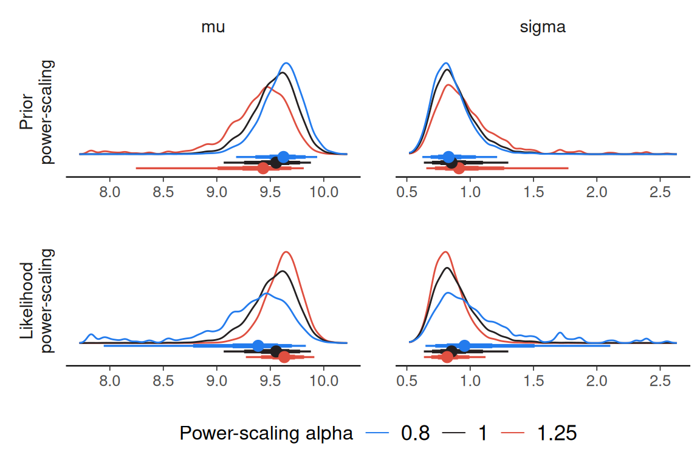

# Using priorsense with Stan

``` r

library(cmdstanr)
library(posterior)
library(priorsense)
```

`priorsense` is compatible with models fit with either `rstan` and
`cmdstanr`. To use `priorsense` with a Stan model, the log prior and log
likelihood evaluations should be added to the model code.

Consider the univariate normal model with unknown mu and sigma available
via`example_powerscale_model("univariate_normal")`. In Stan, `lprior`
and `log_lik` variables can be defined as below. By also defining
separate `lprior_mu` and `lprior_sigma` variables, it will be possible
to check the sensitivity for each prior separately.

``` r

model <- example_powerscale_model("univariate_normal")
```

``` stan
data {
  int<lower=1> N;
  array[N] real y;
}
parameters {
  real mu;
  real<lower=0> sigma;
}
transformed parameters {
  real lprior; // joint prior
  real lprior_mu = normal_lpdf(mu | 0, 1); // marginal prior density for mu
  real lprior_sigma = normal_lpdf(sigma | 0, 2.5); // marginal prior density for sigma
  lprior = lprior_mu + lprior_sigma;
}
model {
  // priors
  target += lprior;
  // likelihood
  target += normal_lpdf(y | mu, sigma);
}
generated quantities {
  vector[N] log_lik;
  // likelihood
  for (n in 1:N) log_lik[n] = normal_lpdf(y[n] | mu, sigma);
}
```

We first fit the model using Stan:

``` r

fit <- rstan::stan(
  model_code = model$model_code,
  data = model$data,
  refresh = FALSE,
  seed = 123
)
```

Then the `priorsense` functions will work as usual.

``` r

powerscale_sensitivity(fit)
```

    Sensitivity based on cjs_dist
    Prior selection: all priors
    Likelihood selection: all data

     variable prior likelihood                           diagnosis
           mu 0.433      0.641 potential prior-likelihood conflict
        sigma 0.359      0.674 potential prior-likelihood conflict

``` r

powerscale_sensitivity(fit, prior_selection = "sigma")
```

    Sensitivity based on cjs_dist
    Prior selection: sigma
    Likelihood selection: all data

     variable prior likelihood diagnosis
           mu 0.006      0.641         -
        sigma 0.010      0.674         -

``` r

powerscale_sensitivity(fit, prior_selection = "mu")
```

    Sensitivity based on cjs_dist
    Prior selection: mu
    Likelihood selection: all data

     variable prior likelihood                           diagnosis
           mu 0.438      0.641 potential prior-likelihood conflict
        sigma 0.369      0.674 potential prior-likelihood conflict

``` r

powerscale_plot_dens(fit)
```



In some cases, setting `moment_match = TRUE` will improve unreliable
estimates at the cost of some further computation. This requires the
[`iwmm` package](https://github.com/topipa/iwmm).
