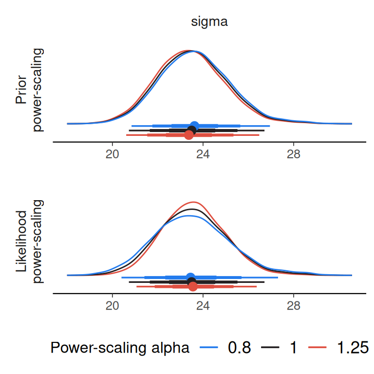
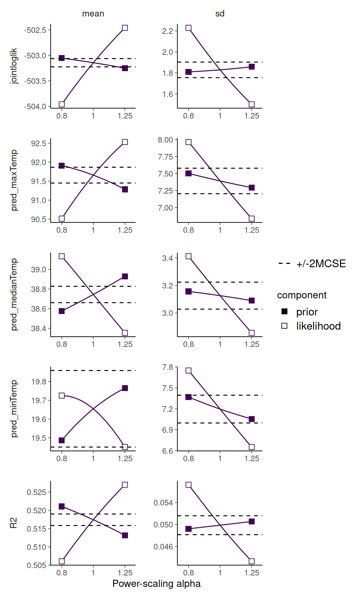

# Selecting priors to power-scale and posterior quantities to check

## Introduction

Priorsense is a package for prior and likelihood sensitivity checks. It
can be used to detect prior-data conflict and weak likelihood.

This vignette demonstrates two different but related concepts: (1)
selecting different priors to power-scale, and (2) specifying which
posterior quantities to check the sensitivity of.

We will fit two different models on the same data set. The first is a
linear model, which has easily interpretable parameters.

The second model includes splines and the spline coefficient parameters
are not as easy to interpret. The specific model is not important, as
the general principles apply for any model that has many parameters,
correlated parameters or uninterpretable parameters. This includes other
models with smooths, non-linear models, Gaussian processes and other
more complex models.

The features used here require `brms` version 2.22.11 or greater.

The main takeaways for this vignette are:

- prior tagging makes it possible to partition priors to make selective
  power-scaling easier

- in more complex models, it is often better to check the sensitivity of
  predictions or predictive measures rather than the parameters

``` r
library(brms)
library(priorsense)
library(posterior)

options(priorsense.plot_help_text = FALSE)
```

We use the `airquality` data set, and fit a model predicting the amount
of ozone based on the temperature.

``` r
data(airquality)
aq <- na.omit(airquality)
```

## Linear model

We first fit a linear model, with some priors specified. For each of the
specified priors we add a `tag`, which will be used later to select
which priors are power-scaled.

``` r
fit_lin <- brm(
  formula = bf(Ozone ~ Temp),
  data = aq,
  family = gaussian(),
  prior = c(
    prior(normal(0, 5), class = "b", coef = "Temp", tag = "b"),
    prior(normal(0, 10), class = "sigma", tag = "sigma"),
    prior(normal(0, 100), class = "Intercept", tag = "intercept")
  ),
  seed = 123,
  refresh = 0,
  silent = 2
)
```

Rather than working with the `brmsfit` object directly, we will first
extract the posterior draws. We will work with `draws` object using the
`posterior` package so derived quantities can be added more easily. The
`brmsfit` does not include the `log_lik` evaluations, so we will add
those to the draws object using
[`posterior::bind_draws`](https://mc-stan.org/posterior/reference/bind_draws.html)

``` r
post_draws_lin <- as_draws_df(fit_lin) |>
  bind_draws(log_lik_draws(fit_lin))
```

As the model is simple, with only one predictor, and each parameter is
directly interpretable, we can perform the power-scaling sensitivity
check directly on all the marginal posteriors of the parameters.

``` r
powerscale_sensitivity(
  post_draws_lin
)
```

    Sensitivity based on cjs_dist
    Prior selection: all priors
    Likelihood selection: all data

        variable prior likelihood                     diagnosis
     b_Intercept 0.006      0.091                             -
          b_Temp 0.006      0.093                             -
           sigma 0.062      0.083 potential prior-data conflict
       Intercept 0.005      0.077                             -

This indicates that when we power-scale all the priors, the posterior of
sigma is changing.

Instead of looking at the parameter posteriors, we can check the
sensitivity of predictions and measures of model fit.

For predictions, we will focus on the predictions at the minimum, median
and maximum temperatures from the data.

For measures of model fit, we will use the in-sample Bayesian R2 and the
joint log-likelihood.

We first define a joint log-likelihood function.

``` r
jointloglik <- function(x) {
  as.matrix(rowSums(log_lik(x)))
}
```

And then bind the draws of the predictions and measures to the posterior
draws using
[`posterior::bind_draws()`](https://mc-stan.org/posterior/reference/bind_draws.html).
For this we will use the `predictions_as_draws` helper function provided
by `priorsense` which transforms predictions from `brms` to draws
objects.

``` r
post_draws_lin <- post_draws_lin |>
  bind_draws(
    predictions_as_draws(
      x = fit_lin,
      predict_fn = bayes_R2,
      prediction_names = "R2",
      summary = FALSE
    )
  ) |>
  bind_draws(
    predictions_as_draws(
      x = fit_lin,
      predict_fn = jointloglik,
      prediction_names = "jointloglik"
    )
  ) |>
  bind_draws(
    predictions_as_draws(
      x = fit_lin,
      predict_fn = posterior_epred,
      prediction_names = c("pred_minTemp", "pred_medianTemp",
                           "pred_maxTemp"),
      newdata = data.frame(
        Temp = c(min(aq$Temp),
                 median(aq$Temp),
                 max(aq$Temp)))
    )
  )

powerscale_sensitivity(
  post_draws_lin
)
```

    Sensitivity based on cjs_dist
    Prior selection: all priors
    Likelihood selection: all data

            variable prior likelihood                     diagnosis
         b_Intercept 0.006      0.091                             -
              b_Temp 0.006      0.093                             -
               sigma 0.062      0.083 potential prior-data conflict
           Intercept 0.005      0.077                             -
                  R2 0.005      0.120                             -
         jointloglik 0.009      0.430                             -
        pred_minTemp 0.006      0.088                             -
     pred_medianTemp 0.006      0.076                             -
        pred_maxTemp 0.007      0.090                             -

In this case, these measures do not appear to be sensitive to
power-scaling the prior. If we are focused on prediction, we might not
be concerned about the potential prior-data conflict for the sigma
parameter. However, as the model is simple and sigma is interpretable we
can continue investigation.

We can confirm that it is the sigma prior that is causing the possible
prior-data conflict, by using the `prior_selection` argument and
specifying the `tag` we defined when creating the priors.

``` r
powerscale_sensitivity(
  post_draws_lin,
  prior_selection = c("sigma", "intercept")
)
```

    Sensitivity based on cjs_dist
    Prior selection: sigma, intercept
    Likelihood selection: all data

            variable prior likelihood                     diagnosis
         b_Intercept 0.004      0.091                             -
              b_Temp 0.004      0.093                             -
               sigma 0.062      0.083 potential prior-data conflict
           Intercept 0.005      0.077                             -
                  R2 0.006      0.120                             -
         jointloglik 0.009      0.430                             -
        pred_minTemp 0.004      0.088                             -
     pred_medianTemp 0.006      0.076                             -
        pred_maxTemp 0.004      0.090                             -

And we can visualise the conflict.

``` r
powerscale_plot_dens(
  post_draws_lin,
  variable = "sigma",
  prior_selection = "sigma"
)
```



Here we can see that there is a tendency for the posterior of sigma to
shift closer to zero when the prior is strengthened (power-scaling alpha
\> 1). In this case, we did not have strong prior information that
informed the prior, so we can consider a wider prior for sigma.

## Spline model

Next we extend our model by adding splines (and use a wider prior on
sigma). This model is more complex, so it is more important to focus on
checking the sensitivity of specific posterior quantities, rather than
all the parameters. Here we will focus on the Bayesian R2, the log-score
and the predictions at the minimum, median and maximum of the observed
temperature.

``` r
fit_spline <- brm(
  formula = bf(Ozone ~ s(Temp)),
  data = aq,
  family = gaussian(),
  prior = c(
    prior(normal(0, 5), class = "b", coef = "sTemp_1", tag = "b"),
    prior(normal(0, 10), class = "sds", coef = "s(Temp)", tag = "sds"),
    prior(normal(0, 30), class = "sigma", tag = "sigma"),
    prior(normal(0, 100), class = "Intercept", tag = "intercept")
  ),
  seed = 123,
  refresh = 0,
  silent = 2
)
```

``` r
post_draws_spline <- as_draws_df(fit_spline) |>
  bind_draws(log_lik_draws(fit_spline)) |>
  bind_draws(
    predictions_as_draws(
      x = fit_spline,
      predict_fn = bayes_R2,
      prediction_names = "R2", summary = FALSE)
  ) |>
    bind_draws(
      predictions_as_draws(
        x = fit_spline,
        predict_fn = jointloglik,
        prediction_names = "jointloglik")
    ) |>
    bind_draws(
      predictions_as_draws(
        x = fit_spline,
        predict_fn = posterior_epred,
        prediction_names = c("pred_minTemp", "pred_medianTemp", "pred_maxTemp"),
        newdata = data.frame(
          Temp = c(min(aq$Temp),
                   median(aq$Temp),
                   max(aq$Temp))
        )
      )
    )
```

We start with power-scaling all priors, but only looking at the effect
on `R2` and `jointloglik` and the predictions.

``` r
powerscale_sensitivity(
  post_draws_spline,
  variable = c("R2", "jointloglik", "pred_minTemp",
               "pred_medianTemp", "pred_maxTemp")
)
```

    Sensitivity based on cjs_dist
    Prior selection: all priors
    Likelihood selection: all data

            variable prior likelihood                     diagnosis
                  R2 0.061      0.242 potential prior-data conflict
         jointloglik 0.043      0.422                             -
        pred_minTemp 0.030      0.062                             -
     pred_medianTemp 0.044      0.124                             -
        pred_maxTemp 0.037      0.130                             -

We see sensitivity in both measures. Next, we selectively power-scale
different priors by specifying the corresponding `tag` in
`prior_selection`.

As this model introduced a prior on the `sds` term, we can start there.

``` r
powerscale_sensitivity(
  post_draws_spline,
  variable = c("R2", "jointloglik", "pred_minTemp",
               "pred_medianTemp", "pred_maxTemp"),
  prior_selection = "sds"
)
```

    Sensitivity based on cjs_dist
    Prior selection: sds
    Likelihood selection: all data

            variable prior likelihood                     diagnosis
                  R2 0.066      0.242 potential prior-data conflict
         jointloglik 0.048      0.422                             -
        pred_minTemp 0.029      0.062                             -
     pred_medianTemp 0.044      0.124                             -
        pred_maxTemp 0.037      0.130                             -

There is clear sensitivity to this prior. We can check all the other
priors at once by providing a vector as the `prior_selection` argument.

``` r
powerscale_sensitivity(
  post_draws_spline,
  variable = c("R2", "jointloglik", "pred_minTemp",
               "pred_medianTemp", "pred_maxTemp"),
  prior_selection = c("intercept", "sigma", "b")
)
```

    Sensitivity based on cjs_dist
    Prior selection: intercept, sigma, b
    Likelihood selection: all data

            variable prior likelihood diagnosis
                  R2 0.007      0.242         -
         jointloglik 0.008      0.422         -
        pred_minTemp 0.003      0.062         -
     pred_medianTemp 0.003      0.124         -
        pred_maxTemp 0.003      0.130         -

We can visualise the effect of power-scaling the `sds` prior on the
posterior `R2`, `jointloglik` and the predictions. Here we visualise the
change in posterior mean and standard deviation.

``` r
powerscale_plot_quantities(
  post_draws_spline,
  div_measure = NULL,
  variable = c("R2", "jointloglik", "pred_minTemp",
               "pred_medianTemp", "pred_maxTemp"),
  prior_selection = "sds"
)
```



Although not extremely sensitive, there is a tendency for the model fit
measures to decrease as the prior is strengthened. This is natural when
strengthening the prior leads to less flexibility in the model. In this
case larger `sds` implies more flexibility in the spline component of
the model. If this is not what we are intending with the choice of prior
on `sds`, we may want to rethink and change it.
